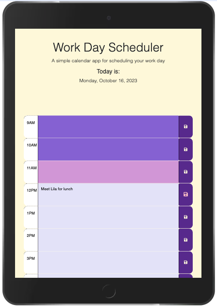

# Day-Calendar

## Description
Create a calendar for the 9-5 schedule.
Keeping a daily calendar which is accessible via any web browser. This calendar color choices reflect a personal preference. The dark purple color lets you know the hour is in the past. The pink color highlights the current hour and the lavender is for future hours. 
The calendar was built with a basic starter code - mostly HTML and CSS. The addition of JavaScript and jQuery add the option updating and saving appoointments to the calendar as well as the changes in color in connection with time of day. 

I gained a better understanding of local storage and the syntax of jQuery. I used a combination of  JavaScript and jQuery to continue to grow my skillset in both languages.

## Table of Contents 
- [Installation](#installation)
- [Usage](#usage)
- [Credits](#credits)
- [License](#license)
## Installation
The calendar runs via the browser and local storage. Here is the [link](https://nchoin.github.io/Day-Calendar/)
## Usage
You can add appointments in the main text fields. To save these to the calendar you MUST click the save button. If you need to edit any appointments or delete an appointment, click in the field, make the changes and click save again.

This is a screenshot of the 

This is a screenshot of the 

## Credits
Thank you to the following people who helped me think through my code, answered my questions and offered suggestions:  

#### UConn BootCamp Instructors:  

  - [Lee Warrick](https://github.com/mynar7) - CSS design, understanding jQuery formatting
  - [Mia Ciasullo](https://github.com/miacias) - JS functionality

I used the following videos to gather more informationa about understanding jQuery, formatting dates and local storage. 

Video for how to [format the date and time](https://www.youtube.com/watch?v=jZUHZDXmQ_A).

Video for [explaining local storage](https://blog.logrocket.com/localstorage-javascript-complete-guide/).

Series about jQuery called [jQuery Crash Course byt Traversy Media](https://www.youtube.com/playlist?list=PLillGF-RfqbYJVXBgZ_nA7FTAAEpp_IAc).

Day.js [website](https://day.js.org/docs/en/display/format).

The AI Xpert Learning Assistant - through edX Boot Camp also provided assistance with specific question on retrieved values from local storage.

## License
Please refer to the LICENSE in the repo.
